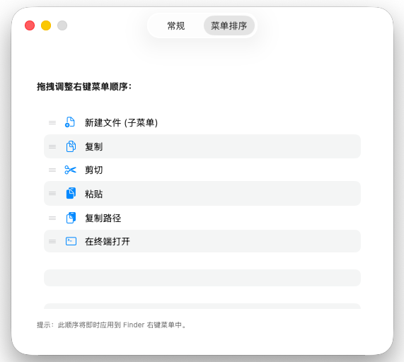
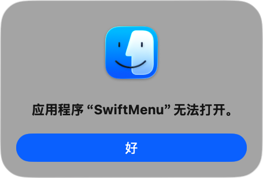

# SwiftMenu

  

  <b>让 macOS Finder 拥有像 Windows 一样高效的右键增强菜单。</b>

  <a href="README_EN.md">English</a> | 中文

  
  
  

---

**SwiftMenu** 是一款原生且轻量级的 macOS Finder 扩展工具，它将 Windows 用户习惯的右键新建文件、复制路径等功能完美带到了 macOS。无需复杂配置，安装即可显著提升您的文件管理效率。

## ✨ 核心功能

- **📄 极速新建文件**：在当前目录下直接创建文件，支持 `.txt`, `.docx`, `.xlsx`, `.pptx`, `.md`。
- **🛠 实用效率工具**：
  - **复制路径**：一键复制选中文件或文件夹的完整绝对路径。
  - **在终端打开**：快速在当前目录唤起终端。
- **🎨 原生视觉体验**：与系统 UI 浑然一体，完美适配 SF Symbols。
- **⚙️ 高度可自定义**：在主应用中自由勾选需要显示的菜单项，支持开机自启。

## 📸 软件截图

<table align="center">
  <tr>
    <td align="center"><b>右键增强菜单</b></td>
    <td align="center"><b>自定义设置中心</b></td>
    <td align="center"><b>自定义菜单调整顺序</b></td>
  </tr>
  <tr>
    <td align="center"></td>
    <td align="center"></td>
    <td align="center"></td>
  </tr>
</table>

## 💻 系统要求

在安装 SwiftMenu 之前，请确保您的设备满足以下要求：

| 项目 | 最低要求 |
|------|---------|
| **操作系统** | macOS 12.0 (Monterey) 或更高版本 |
| **芯片** | Apple Silicon (M1/M2/M3/M4) 或 Intel 处理器 |

> 💡 **提示**：如果您运行的是 macOS Sequoia 15.x 或更新版本，SwiftMenu 完全兼容。

## 🚀 安装指南

> ⚠️ **重要提示：如果遇到"应用程序无法打开"**
>
> 首次安装后，如果双击打开遇到**“文件已损坏”**或**“无法打开”**的提示，这是 macOS 针对开源软件的安全机制拦截，并非文件真的损坏。
>
> 
>
> **💡 正确打开方式（仅需一次）：**
> 1. **右键点击** SwiftMenu 图标。
> 2. 选择菜单中的 **“打开”**。
> 3. 在弹出的安全确认框中再次点击 **“打开”** 即可。

### 1. 下载与安装
1. 前往 [Releases](https://github.com/wample0105/SwiftMenu/releases) 下载最新的 `SwiftMenu_Installer.dmg`。
2. 打开 DMG，将 `SwiftMenu.app` 拖入 **应用程序 (Applications)** 文件夹。
3. **关键：** 首次运行请**右键点击**应用图标并选择“打开”，在安全提示中再次点击“打开”。

### 2. 启用 Finder 扩展
1. 打开 **系统设置** → **隐私与安全性** → **扩展**。
2. 点击 **Finder 扩展**，勾选 ✅ **SwiftMenu**。
3. 如果菜单没有立即显示，请右键点击 Dock 上的 Finder 图标并选择“重新启动”，或者在终端执行 `killall Finder`。

## 📝 使用方法

- **新建文件**：在 Finder 空白处或文件夹上右键，选择“新建...”并挑选文件类型。
- **复制路径**：右键点击文件或文件夹，选择“复制路径”。
- **在终端打开**：右键点击文件夹或空白处，选择“在终端打开”。
- **自定义菜单**：打开 SwiftMenu 主应用，即可实时开启或关闭功能项。

## ❓ 常见问题

- **Q: 为什么右键菜单没出来？**
  - A: 请检查“系统设置”中的“Finder 扩展”是否已勾选 SwiftMenu。若已勾选仍不显示，请尝试重启 Finder。
- **Q: 提示“无法打开，因为苹果无法检查其是否包含恶意软件”？**
  - A: 这是 macOS 的安全机制。请在应用程序文件夹中**右键点击** SwiftMenu，选择“打开”，在弹出的对话框中再次确认“打开”。

## 🗑️ 卸载方法

1. 在“系统设置”中取消勾选 **SwiftMenu** 扩展。
2. 退出 SwiftMenu 进程。
3. 将应用程序文件夹中的 `SwiftMenu.app` 移除到废纸篓。

## 🛠 开发与构建

1. 克隆仓库：`git clone https://github.com/wample0105/SwiftMenu.git`
2. 使用 Xcode 打开 `SwiftMenu.xcodeproj`。
3. 构建并运行 `SwiftMenu` Scheme。

---

  由 <a href="https://github.com/wample0105">阿坡</a> 用 ❤️ 制作

