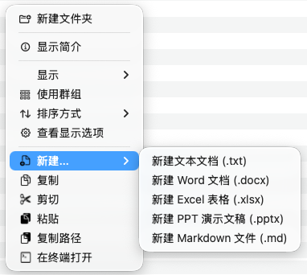
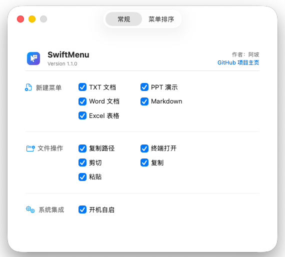

# SwiftMenu

  

  <b>Boost your macOS Finder workflow with Windows-like right-click context menu.</b>

  English | <a href="README.md">中文</a>

  
  
  

---

**SwiftMenu** is a native and lightweight macOS Finder extension that brings Windows-style right-click features like creating new files, copying paths, and opening terminals directly to macOS. Significantly boost your file management efficiency with zero complex configuration.

## ✨ Core Features

- **📄 Fast File Creation**: Create files instantly in the current directory: `.txt`, `.docx`, `.xlsx`, `.pptx`, `.md`.
- **🛠 Essential Utilities**:
  - **Copy Path**: Copy the full absolute path of selected files or folders to clipboard instantly.
  - **Open in Terminal**: Quickly open Terminal at the current directory.
- **🎨 Native Visual Experience**: Seamlessly integrated with macOS UI using native SF Symbols.
- **⚙️ Highly Customizable**: Toggle specific menu items via the main app and enable Launch at Login.

## 📸 Screenshots

<table align="center">
  <tr>
    <td align="center"><b>Enhanced Context Menu</b></td>
    <td align="center"><b>Custom Settings Center</b></td>
  </tr>
  <tr>
    <td align="center"></td>
    <td align="center"></td>
  </tr>
</table>

## 🚀 Installation Guide

### 1. Download & Install
1. Go to [Releases](https://github.com/wample0105/SwiftMenu/releases) and download the latest `SwiftMenu_Installer.dmg`.
2. Open the DMG and drag `SwiftMenu.app` into your **Applications** folder.
3. **Critical:** For the first run, **Right-click** the app icon and choose "Open", then click "Open" again in the security prompt.

### 2. Enable Finder Extension
1. Open **System Settings** → **Privacy & Security** → **Extensions**.
2. Click **Finder Extensions** and check ✅ **SwiftMenu**.
3. If the menu doesn't appear immediately, Right-click the Finder icon on the Dock and select "Relaunch", or execute `killall Finder` in Terminal.

## 📝 How to Use

- **New File**: Right-click in a Finder blank space or on a folder, select "New..." and choose a file type.
- **Copy Path**: Right-click on a file or folder and select "Copy Path".
- **Open in Terminal**: Right-click on a folder or blank space and select "Open in Terminal".
- **Customize Menu**: Open the SwiftMenu main app to toggle feature items in real-time.

## ❓ FAQ

- **Q: Why doesn't the context menu show up?**
  - A: Please ensure "SwiftMenu" is checked in "System Settings" -> "Finder Extensions". If it's already checked but still missing, try relaunching Finder.
- **Q: "SwiftMenu cannot be opened because Apple cannot check it for malicious software"?**
  - A: This is a macOS security mechanism for unsigned apps. **Right-click** SwiftMenu in the Applications folder, select "Open", and confirm "Open" in the dialog.

## 🗑️ Uninstallation

1. Uncheck the **SwiftMenu** extension in "System Settings".
2. Quit the SwiftMenu process.
3. Move `SwiftMenu.app` from the Applications folder to the Trash.

## 🛠 Development & Build

1. Clone the repo: `git clone https://github.com/wample0105/SwiftMenu.git`
2. Open `SwiftMenu.xcodeproj` in Xcode.
3. Build and run the `SwiftMenu` scheme.

---

  Made with ❤️ by <a href="https://github.com/wample0105">阿坡</a>

