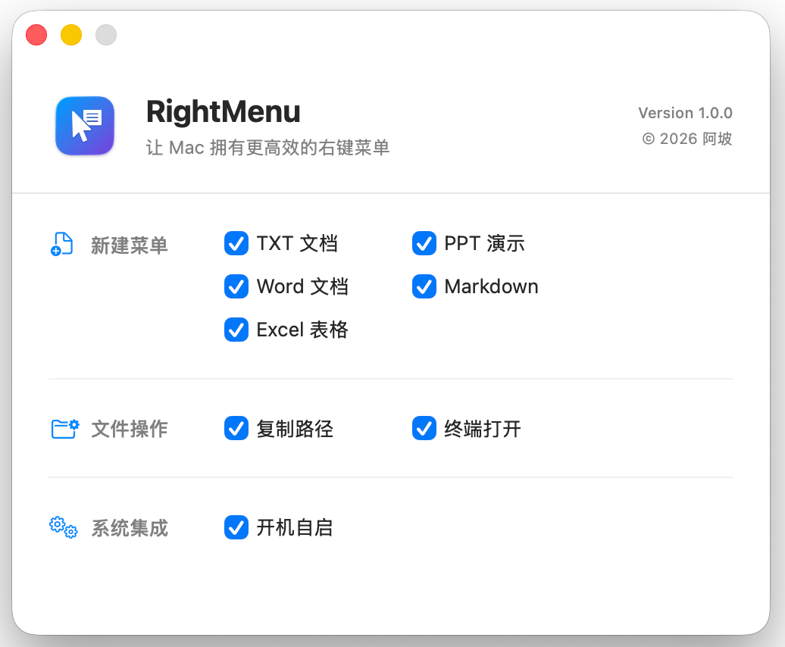

# SwiftMenu

<p align="center">
  
</p>

<p align="center">
  <b>Boost your macOS Finder workflow with Windows-like right-click context menu.</b>
</p>

<p align="center">
  English | <a href="README.md">中文</a>
</p>

<p align="center">
  
  
  
</p>

---

**SwiftMenu** is a lightweight, native macOS Finder Sync Extension that brings the convenient right-click menu usage (common in Windows) to macOS. It allows you to quickly create new files, copy paths, and open terminals directly from the Finder context menu without any complex setup.

## ✨ Features

- **📄 Fast File Creation**
  Create files instantly in the current directory:
  - Text Document (`.txt`)
  - Microsoft Word (`.docx`)
  - Microsoft Excel (`.xlsx`)
  - Microsoft PowerPoint (`.pptx`)
  - Markdown File (`.md`)

- **🛠 Essential Utilities**
  - **Copy Path**: Copy the absolute path of selected files or folders to clipboard.
  - **Open in Terminal**: Launch Terminal at the current directory immediately.

- **🎨 Native Experience**
  - Built with **Swift** and **FinderSync framework**.
  - Uses native **SF Symbols** for a seamless look and feel.
  - Optimized for macOS, lightweight and battery-friendly.

- **⚙️ Customizable**
  - Toggle specific menu items on/off via the main app.
  - Supports **Launch at Login** to keep your productivity tool ready.

## 📸 Screenshots

<table align="center">
  <tr>
    <td align="center"><b>Enhanced Context Menu</b></td>
    <td align="center"><b>Settings Center</b></td>
  </tr>
  <tr>
    <td align="center"></td>
    <td align="center"></td>
  </tr>
</table>

## 📥 Installation

### 1. Download App
Go to the [Releases](https://github.com/your_username/SwiftMenu/releases) page and download the latest version.

### 2. Installation
1. Drag `SwiftMenu.app` to your **Applications** folder.
2. **First Run**: Right-click the icon and choose "Open", then click "Open" again in the security alert.

### 3. Enable Extension
1. Open **System Settings**.
2. Go to **Privacy & Security** -> **Extensions**.
3. Select **Finder Extensions**.
4. Check the box next to **SwiftMenu**.

> **Pro Tip**: If the menu doesn't appear, right-click the Finder icon on Dock and select "Relaunch", or execute `killall Finder` in terminal.

## 🛠 Development Build

### Requirements
- macOS 13.0+
- Xcode 14.0+
- Swift 5.0+

### Build from Source
1. Clone the repository:
   ```bash
   git clone https://github.com/your_username/SwiftMenu.git
   ```
2. Open `ApoRightMenu.xcodeproj` in Xcode.
3. Select your development team in **Signing & Capabilities**.
4. Build and run the `ApoRightMenu` scheme.

## 🤝 Contributing

Contributions are welcome! Please feel free to submit a Pull Request.

1. Fork the Project
2. Create your Feature Branch (`git checkout -b feature/AmazingFeature`)
3. Commit your Changes (`git commit -m 'Add some AmazingFeature'`)
4. Push to the Branch (`git push origin feature/AmazingFeature`)
5. Open a Pull Request

## 📄 License

Distributed under the MIT License. See `LICENSE` for more information.

---
<p align="center">
  Made with ❤️ by <a href="https://github.com/your_username">阿坡</a>
</p>
