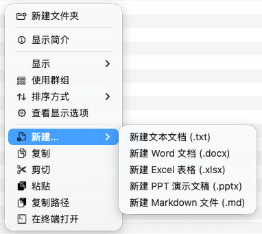
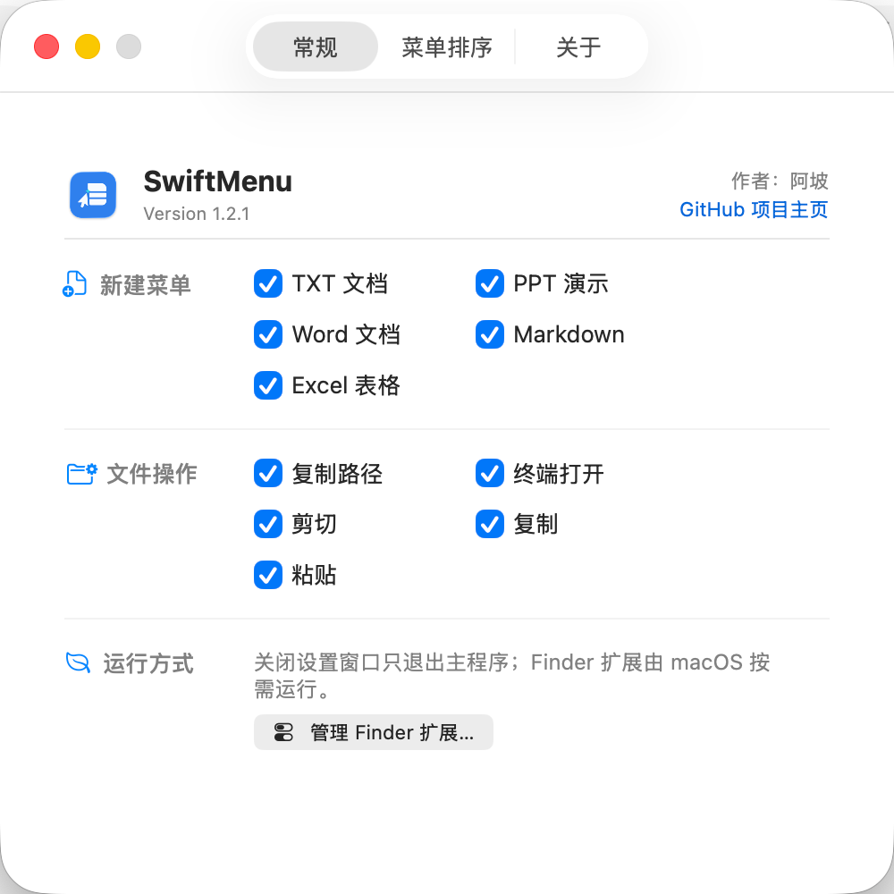
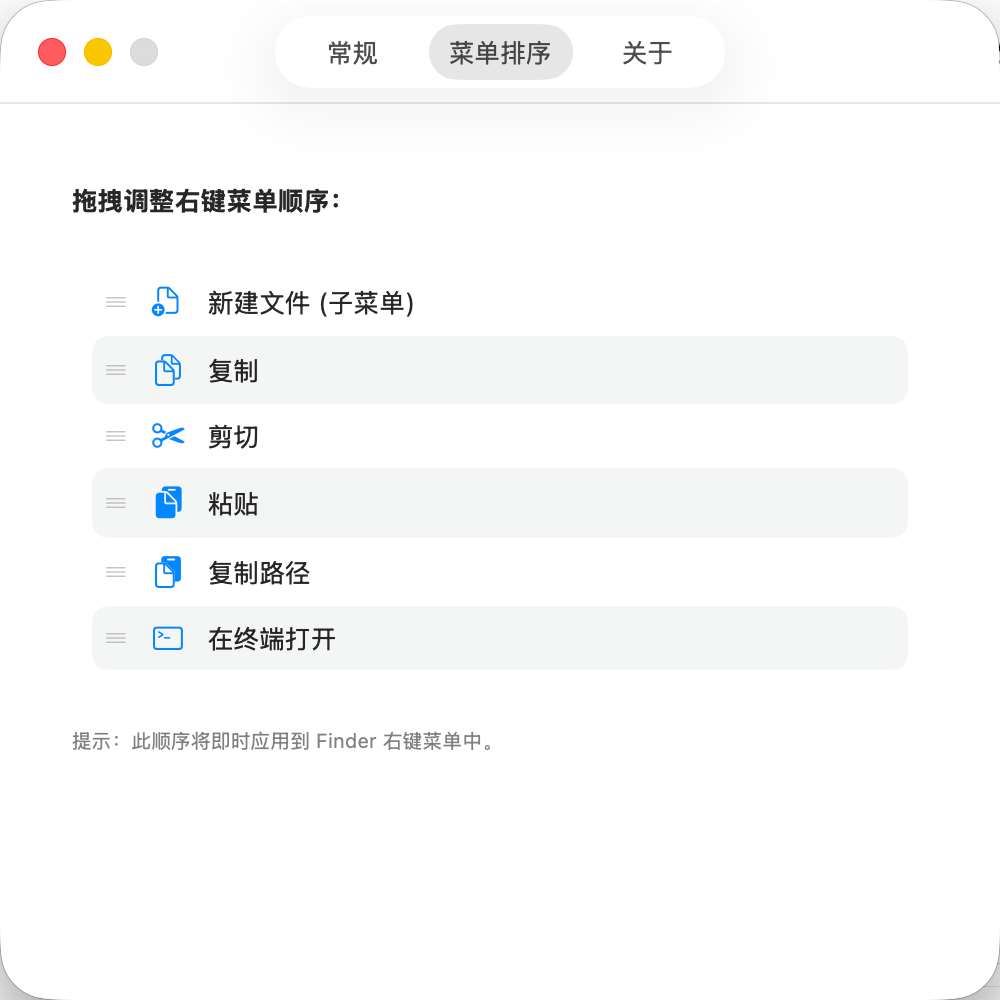

# SwiftMenu

<p align="center">
  
</p>

<p align="center">
  <b>Boost your macOS Finder workflow with Windows-like right-click context menu.</b>
</p>

<p align="center">
  English | <a href="README.md">中文</a>
</p>

<p align="center">
  
  
  
</p>

---

**SwiftMenu** is a native and lightweight macOS Finder extension that brings Windows-style right-click features like creating new files, copying paths, and opening terminals directly to macOS. Significantly boost your file management efficiency with zero complex configuration.

## ✨ Core Features

- **📄 Fast File Creation**: Create files instantly in the current directory: `.txt`, `.docx`, `.xlsx`, `.pptx`, `.md`.
- **🛠 Essential Utilities**:
  - **Copy Path**: Copy the full absolute path of selected files or folders to clipboard instantly.
  - **Open in Terminal**: Quickly open Terminal at the current directory.
- **🎨 Native Visual Experience**: Seamlessly integrated with macOS UI using native SF Symbols.
- **⚙️ Highly Customizable**: Toggle and reorder menu items; the settings app exits when its window closes.
- **🌿 On-Demand by Design**: macOS manages the Finder extension without polling, heartbeat files, or a keep-alive process.

## 📸 Screenshots

<table align="center">
  <tr>
    <td align="center"><b>Enhanced Context Menu</b></td>
    <td align="center"><b>Custom Settings Center</b></td>
    <td align="center"><b>Custom Menu Order</b></td>
  </tr>
  <tr>
    <td align="center"></td>
    <td align="center"></td>
    <td align="center"></td>
  </tr>
</table>

## 💻 System Requirements

Before installing SwiftMenu, please ensure your device meets the following requirements:

| Item | Minimum Requirement |
|------|---------------------|
| **Operating System** | macOS 12.0 (Monterey) or later |
| **Chip** | Apple Silicon (M1/M2/M3/M4) or Intel processor |

> 💡 **Tip**: Before each production release, compatibility is validated on the minimum supported and current stable macOS versions using `Docs/PERFORMANCE_ACCEPTANCE.md`.

## 🚀 Installation Guide

Production packages use Developer ID signing, Hardened Runtime, and Apple notarization so macOS Gatekeeper can validate them normally.

If a download is explicitly marked **Not Notarized** or **Testing Only**, follow the steps below only after verifying the source and checksum. Create an exception for SwiftMenu alone—do not disable Gatekeeper system-wide.

### 1. Download & Install
1. Go to [Releases](https://github.com/wample0105/SwiftMenu/releases) and download the latest `SwiftMenu_<version>.dmg`.
2. Open the DMG and drag `SwiftMenu.app` into your **Applications** folder.
3. Open SwiftMenu normally and configure the menu.

### 2. First Launch of an Unnotarized Test Build

1. Try opening `/Applications/SwiftMenu.app` once. Dismiss the warning if macOS says the developer cannot be verified or Apple cannot check the app for malicious software.
2. Open **System Settings** → **Privacy & Security**, then scroll down to **Security**.
3. Find the SwiftMenu warning, click **Open Anyway**, enter your login password, and confirm **Open**. The button is normally available for about one hour after the failed launch attempt.
4. macOS saves this SwiftMenu build as an individual exception, so future launches work normally.

See Apple’s official guide: [Open an app by overriding security settings](https://support.apple.com/en-euro/guide/mac-help/mh40617/mac).

Experienced Terminal users can remove the quarantine attribute from SwiftMenu only:

```bash
xattr -dr com.apple.quarantine "/Applications/SwiftMenu.app"
open "/Applications/SwiftMenu.app"
```

> ⚠️ Do this only after confirming the file came from the project’s official Release and was not modified. Do not use `sudo spctl --master-disable` to disable Gatekeeper globally. Stop if macOS explicitly reports malware, a damaged file, or an organization-managed policy.

### 3. Enable Finder Extension
1. Open **System Settings** → **General** → **Login Items & Extensions**.
2. Manage **Finder Extensions** in the Extensions section and enable ✅ **SwiftMenu**. On older macOS versions, use **System Preferences → Extensions → Finder Extensions**.
3. If the menu doesn't appear immediately, Right-click the Finder icon on the Dock and select "Relaunch", or execute `killall Finder` in Terminal.

## 📝 How to Use

- **New File**: Right-click in a Finder blank space or on a folder, select "New..." and choose a file type.
- **Copy Path**: Right-click on a file or folder and select "Copy Path".
- **Open in Terminal**: Right-click on a folder or blank space and select "Open in Terminal".
- **Customize Menu**: Open SwiftMenu to toggle and reorder items. Closing the window exits the settings app, so it does not remain resident.

## ❓ FAQ

- **Q: Why doesn't the context menu show up?**
  - A: Please ensure "SwiftMenu" is checked in "System Settings" -> "Finder Extensions". If it's already checked but still missing, try relaunching Finder.
- **Q: Why is the SwiftMenu main app absent from Activity Monitor after I close it?**
  - A: This is expected. The main app only edits settings and exits when closed; macOS loads the Finder extension on demand.
- **Q: Why are there two SwiftMenu-related processes while Settings is open?**
  - A: One is the settings app and the other is the separately hosted **SwiftMenu Finder Extension**. They are not duplicate launches. Closing the settings window exits the main app.
- **Q: How do I stop the Finder extension completely?**
  - A: Click **Manage Finder Extension…** in SwiftMenu’s General settings, then turn SwiftMenu off in System Settings. Quitting the settings app alone does not disable the context-menu extension.

## 🗑️ Uninstallation

1. Uncheck the **SwiftMenu** extension in "System Settings".
2. Quit the SwiftMenu process.
3. Move `SwiftMenu.app` from the Applications folder to the Trash.

## ☕ Follow & Connect

If SwiftMenu helps you, follow the project, join the community, or buy the author a coffee.

<table align="center">
  <tr>
    <td align="center"><b>WeChat Official Account</b></td>
    <td align="center"><b>Contact the Author</b></td>
    <td align="center"><b>Support the Project</b></td>
  </tr>
  <tr>
    <td align="center"></td>
    <td align="center"></td>
    <td align="center"></td>
  </tr>
  <tr>
    <td align="center"><b>阿坡RPA</b><br />Get SwiftMenu updates and useful tools</td>
    <td align="center"><b>阿坡</b><br />Send “SwiftMenu” to join the community</td>
    <td align="center"><b>Buy the author a coffee</b><br />Voluntary donations are appreciated</td>
  </tr>
</table>

<p align="center">Open an image at full size, then save it with a long press or right-click.</p>

## 🛠 Development & Build

1. Clone the repo: `git clone https://github.com/wample0105/SwiftMenu.git`
2. Open `SwiftMenu.xcodeproj` in Xcode.
3. Build and run the `SwiftMenu` scheme.
4. Run `./scripts/run_tests.sh` for file-operation tests and macOS 12 compatibility type checking.

Use `./scripts/build_and_package.sh` for production delivery. It runs tests, archives, exports with Developer ID, verifies signatures, creates the DMG, notarizes, staples the ticket, and performs a Gatekeeper assessment. Configure `NOTARYTOOL_PROFILE` first.

---
<p align="center">
  Made with ❤️ by <a href="https://github.com/wample0105">阿坡</a>
</p>
